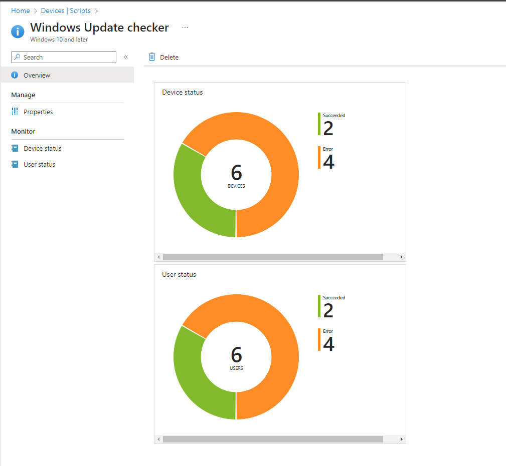

# WindowsUpdateCheck.ps1
This PowerShell script checks for Windows updates with installation results of 'Failed' or 'SucceededWithErrors' and logs the results to a file. The log file can be uploaded to Intune as a device configuration script output to view the results for each device.

#### to run Invoke-Expression .\WindowsUpdateCheck.ps1

## Path to find log 
<pre>
C:\ProgramData\Microsoft\IntuneManagementExtension\Logs\WindowsUpdate.log
</pre>

## Prerequisites
To use this script, you will need to have the following:

- A Microsoft Intune subscription
- Access to the Microsoft Endpoint Manager admin center
- PowerShell version 5.1 or later

## Changes Made
Previously, this script required the installation of the PSWindowsUpdate module to check for updates. This made it challenging to use the script in an Intune environment where installing additional modules can be challenging. In this version of the script, the PSWindowsUpdate module has been removed, and the code has been updated to use the Windows Update settings on the local machine to check for updates.

The changes made to the code include:

- Replacing the Get-WUList cmdlet with Get-WindowsUpdate to check for updates using the Windows Update settings on the local machine
- Removing the code that installs the PSWindowsUpdate module
- Updating the log message to reflect that the script is checking for updates using the Windows Update settings
- Updating the loading bar to reflect the changes in the code
- Updated the script to check for updates using Windows Update settings instead of downloading them directly.
- Removed the MaxUpdatesPerDownload parameter from the Get-WindowsUpdate cmdlet to avoid errors when running the script without admin privileges.
- Updated the script to check the Windows Update auto-download setting before running.
- Added a message to indicate whether updates were checked or not in the log file.
- Added a loading bar to show progress while checking for updates.
- Removed the installation of updates to prevent unintended changes to the system.
- Fixed file permission errors that occurred when writing to the log file.

## How to Use
To use this script, save the code to a PowerShell script file (e.g., WindowsUpdateCheck.ps1) and run it from an elevated PowerShell prompt. The script will check for updates using the Windows Update settings on the local machine and log any updates that are needed to a log file located at "C:\ProgramData\Microsoft\IntuneManagementExtension\Logs\WindowsUpdate.log".

This script can be used in an Intune environment without the need to install additional modules. To use it in Intune, upload the script to Intune and create a PowerShell script deployment policy. When the policy is applied to a device, the script will run, and the log file will be uploaded to Intune for review.

## Intune 

I have connected this to the Intune scripts section and the results are as shown:

### device | scripts:

### Status:

### Results:

## Issues

#### 05/05/2023 ####
- ~~Firstly, the parameter MaxUpdatesPerDownload is not supported by the Get-WindowsUpdate cmdlet. This is causing the error message: "A parameter cannot be found that matches parameter name 'MaxUpdatesPerDownload'."~~

- ~~Secondly, there is an access denied error when attempting to write to the log file. This suggests that the user running the script does not have permission to write to that location.~~

- ~~To fix these issues, you could remove the MaxUpdatesPerDownload parameter and modify the code to write to a location that the user running the script has permission to access.~~

- ~~Runs and works issue is the format of log date and time show after update been made~~

## Usage
To use this script, follow these steps:

1. Sign in to the Microsoft Endpoint Manager admin center.
2. Click on "Devices" in the left-hand menu, and then click on "Scripts".
3. Click on "Add" to create a new script.
4. Copy the script code from the WindowsUpdateCheck.ps1 file in this repository.
5. Paste the code into the "Script" section of the "Add script" blade.
6. Configure any settings or parameters as needed.
7. Click on "Create" to save the script.
8. Assign the script to devices or groups of devices as needed.

## Output
This script generates a log file with the results of the Windows update check. The log file is saved to the user's temp directory with the name WindowsUpdate.log. You can upload the log file to Intune as a device configuration script output to view the results for each device.

## Uploading to Intune
To upload the log file to Intune, you can use the Set-CMDeviceConfigurationScriptResult cmdlet in PowerShell. See the script code for an example of how to upload the log file.

Note that uploading the log file to Intune may incur additional costs for storage and data transfer. You may want to configure retention policies to delete old log files after a certain period of time to manage storage costs.

### Contributing
If you have a script that you think would be useful for other Intune users, feel free to contribute it to this repository. To contribute a script, create a new file in the scripts directory with a descriptive name and the .ps1 extension. Please also include a brief description of the script in the README file.

### License
None

# Disclaimer #

This script is provided as-is and without warranty or support. It is your responsibility to test and validate this script before using it in a production environment. Use at your own risk.